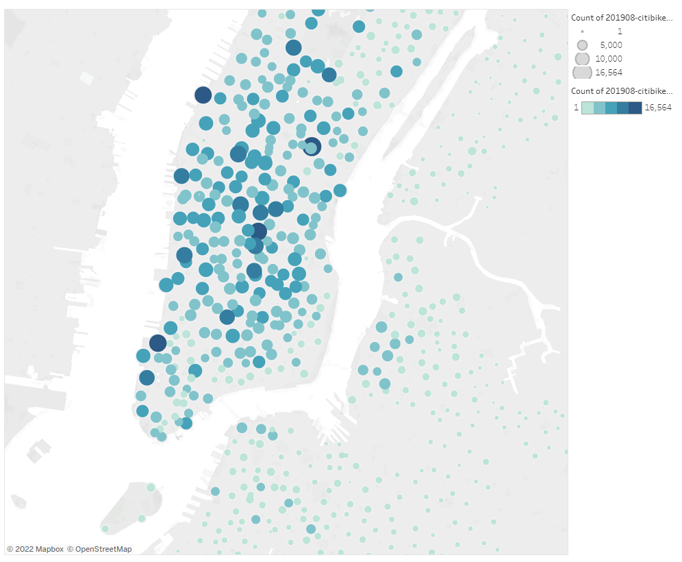

# Bike_sharing

## Overview of Project  

**Purpose:**  
The purpose of this project is to create a visualization and proposal to start a bike sharing service in Des Moines, Iowa.  

## Resources:  
- Data Source: Provided [Data](https://ride.citibikenyc.com/system-data) (Using data from August 2019)
- Software: Tableau Public, Tableau 2021.4, Python 3.9.7, Jupyter Notebook 6.4.6

## Analysis and Results  

**Analysis:**  
For this project, we used data from a bike sharing service in NYC in August 2019. We used this data because we know that bike sharing services are popular in NYC as well as in the month of August because of the warmer weather when people would be outside travelling or touring the city. We created a few different graphs and heat maps from out dataset to help visualize our story and our proposal to start a bike sharing service in Des Moines, Iowa. We created heat maps for popular starting and ending locations for renting the bikes. Next, we created a chart displaying trip duration, as well as trip duration by gender. From there, we created a few more heat maps for "time of day" and "day of the week" when the bikes get rented, as well as another heat map broken down by gender. The bike share service also allows users to subscribe, assuming to allow users to use the bikes more frequently without the extra time or cost to register and pay for each session, to be analyzed and broken down by gender as well.  

**Results:**  
(Please refer to the images below if you do not wish to follow along with the story page link)  
When visiting our [story page](https://public.tableau.com/app/profile/tony.wang5909/viz/CitiBikes_Challenge_16456370603210/GenderandWeekdaybreakdownonBikeSharinginNYC), the first thing you see should be a heat map of top starting locations. Areas with greater and darker circles represents a higher concentration of people starting their rental from that location. Those areas could have closer proximety to where the users live, close to work, or near outdoor attractions. The second page, Checkout Times for Users, displays the length of time users rent the bikes. We can see the majority of the bike rentals are less than 30 minutes. This could be related to work commutes and rides greater than 30 minutes could be related to tousist travelling and exploring the city. Page three breaks down the same graph, but also separates the data by gender. Following that, we have a heat map for "time of day" and "day of the week" when most of the bikes are being rented. We can see the majority of the times are during the weekday instead of weekend and during the times when people are leaving to go to work (around 8am) or leaving work to return home (around 5pm). We also broke this heat map down on the next page, to include a gender breakdown as well. We also took into account on concentration of subscribers and customers on the next page, User Trips by Gender. This page has a similar breakdown of the previous heat maps, but includes subscribers vs customers and separated by gender. Subscribers tends to use the bikes more regularly compared to customers, which makes sense as they can use them more frequently without incurring additional charges to each time they rent bikes. The last page displays the popular ending locations for the bikes. This map looks similar to the starting locations. If people leave to a different location, they would also at somepoint return to their starting locations because by assumption users are starting from their home and leaving for work or to run errards, but would eventually return back home.  

  
  
  
  
  
  
  

Overall, we can see that the majority of the users tends to use the bikes around peak rush hours times before work and after work as they are renting bikes to commute to and from work. As well, we can see there are a higher number of users who are male vs female. This could be because there is a higher male to female ratio of NYC residents. Or males have a higher preference to travel by rental bikes compared to females. Or even some other reason that is still unknown to us.  

## Challenge Summary  

**Summary**  
The purpose of this project is to create a visualization and proposal to start a bike sharing service in Des Moines, Iowa by using NYC bike sharing data to assist with our presention. We created different charts and heat maps to display overall usage and popularity with communting and exploring the area.  

- One recommendation for further analysis is to analyze the bikeID and the trip duration to account for how long each bike is being checkout for repair and maintaince purposes. Similar to cars needing maintaince at certain milage to prevent total breakdown, if our bikes are up to date on their repairs and maintainces, this could prevent users from writing poor reviews if the bikes breakdown during this rental trip.  

- Another recommendation to explore further would be to see if there is a correlation with bikeID and matching it with trip duration and gender to see if either male or female users would cause greater wear and tear of the bikes. Similar to car insurance, for example, males tend to have higher car insurance costs compared to that of females.  

- A third recommendation to explore further would be to see why there is a higher male to female ratio for rental bike travel to we could analyze and explore.  

### Codes Used  
(Please look at specific files for codes used)   
Code for [building DataFrame](https://github.com/tonywang3571/Bike_Sharing/blob/master/NYC_Citibike_Challenge.ipynb)   
Link to [story page](https://public.tableau.com/app/profile/tony.wang5909/viz/CitiBikes_Challenge_16456370603210/GenderandWeekdaybreakdownonBikeSharinginNYC)  

